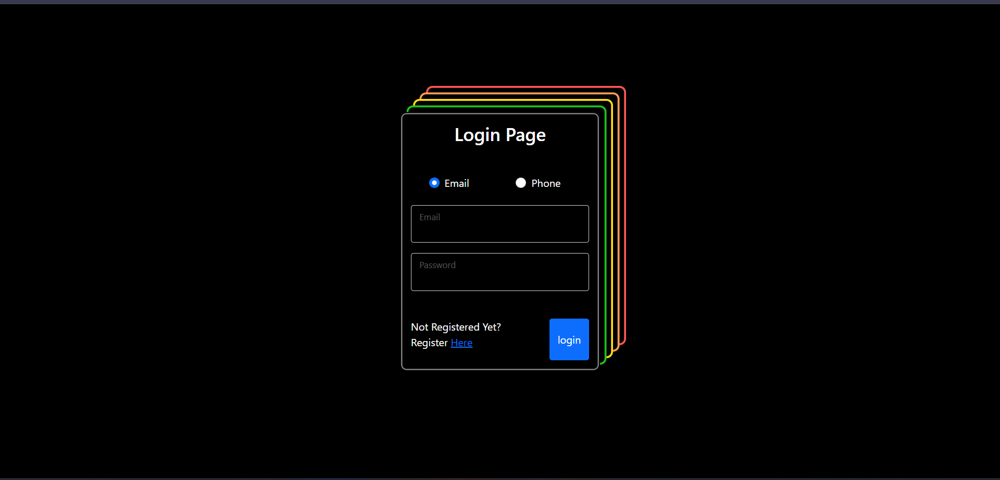
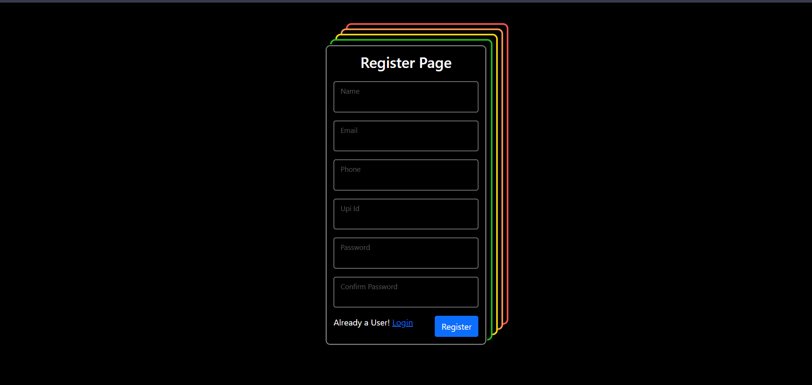
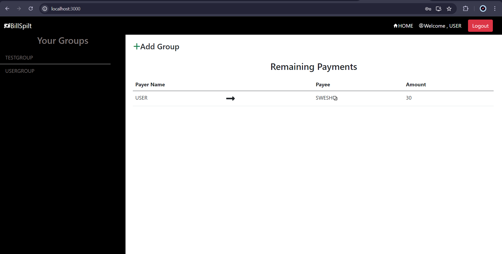
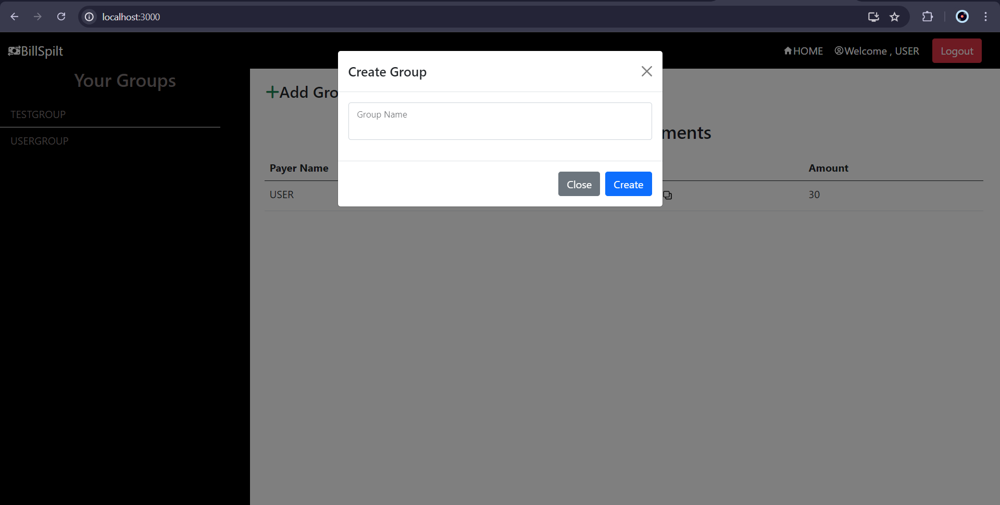
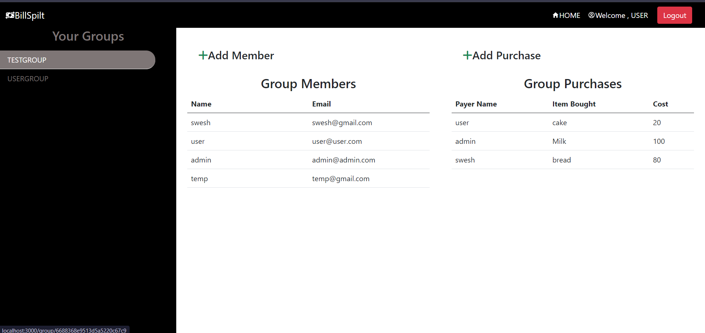
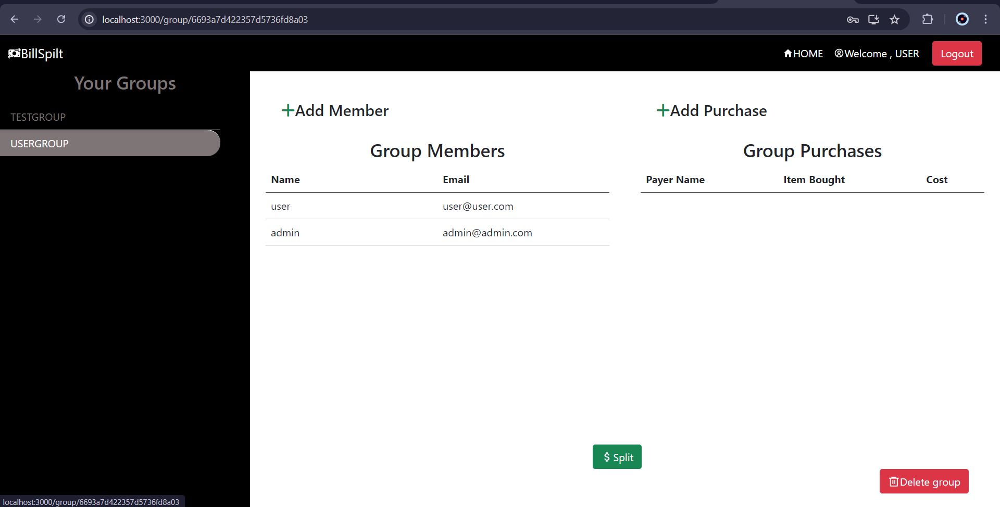
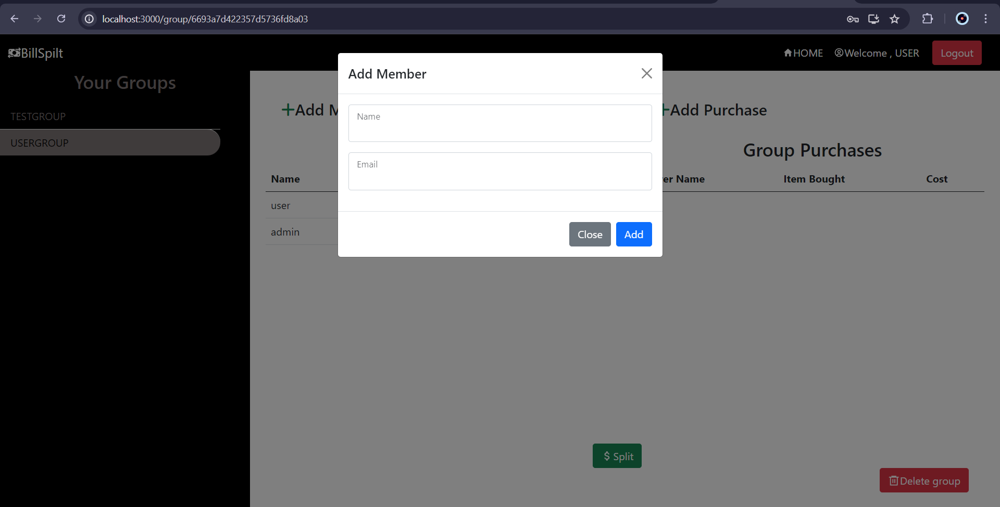
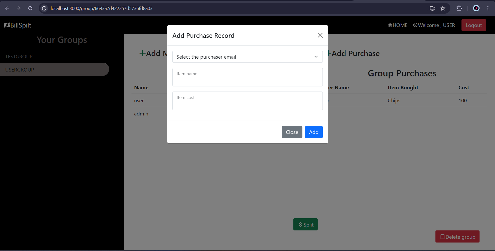

# BillSplit

BillSplit is a MERN stack application designed to optimize and minimize transactions when splitting bills among a group of people. Whether you're out dining with friends or sharing expenses while living together, BillSplit ensures that the number of transactions required to settle debts is minimized, making the process smooth and efficient.
## Features
#### **Login Page**: Users can securely log into their accounts.
<br><br/>

<br><br/>
#### **Register Page**: New users can create an account to start using the application.
<br><br/>

<br><br/>
### HomePage
- **Home Page**: Users can view their groups, see the amounts they owe or are owed by other members, and access other essential features.
<br><br/>
  
<br><br/>
- **Create Groups**: Users can create new groups for different events or situations where expenses need to be shared.
<br><br/>
   
<br><br/>

### Group Dashboard
- **DashBoard Page**: Each group has a dashboard page where members can view all relevant details.
- **Finalize Group**: The group admin (creator) has the option to finalize the group expenses, triggering the bill splitting process.
- **Delete Group**: The admin can delete the group once all transactions are settled.
<br><br/>
   
<br><br/>
<br><br/>
   
<br><br/>
<br><br/>
- **Add Members**: Users can add other members to their groups. Group members will be able to see the group's information and contribute to expense tracking.
<br><br/>
<br><br/>
   
<br><br/>
- **Add Purchase Information**: Users can log purchases made on behalf of the group. This information is used to calculate the amount each member owes.
<br><br/>
<br><br/>
   
<br><br/>

### Optimized Transactions
- **Minimized Transactions**: After finalizing, the application displays the minimized number of transactions required for each group member to settle their debts, making it easy for everyone to pay back the right amount.

## Getting Started

### Prerequisites
- JavaScript
- Node.js
- MongoDB
- React.js

### Installation
1. Clone the repository:
   ```sh
   git clone https://github.com/your-username/BillSplit.git
   
2. Install server dependencies:
   ```sh
    npm install
### Running the Application

1. Running client side and server side concurrently:
   ```sh
   npm run dev

### Contributing
Contributions are welcome! Please fork the repository and submit a pull request for review.
